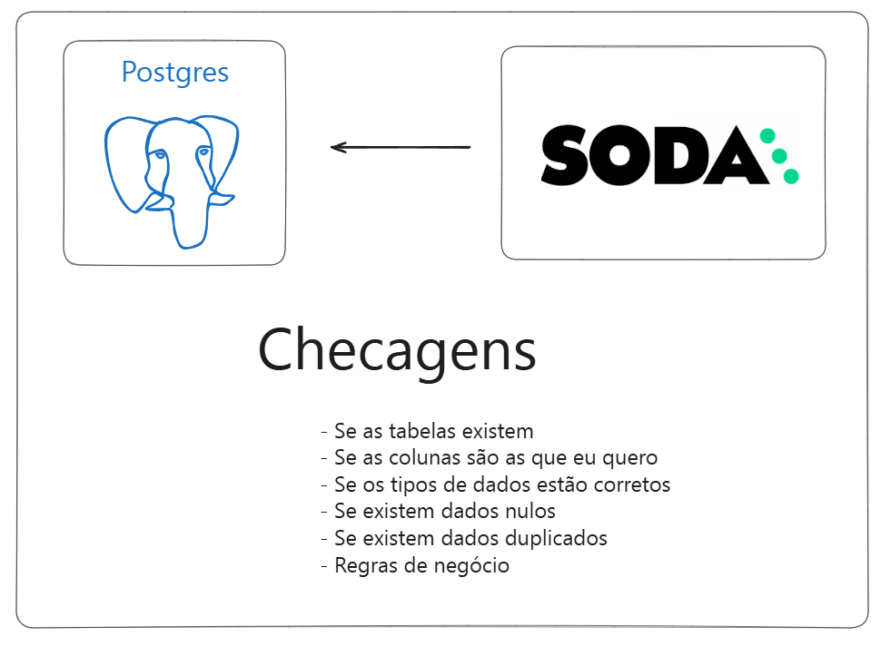

# Data Quality
O projeto consiste em demonstrar como podemos utilizar data quality em projetos de engenharia de dados.

## Vídeo tutorial
link: https://www.youtube.com/watch?v=F2HFRKKdyz4

## Arquitetura


## Objetivo
Garantir a veracidade dos dados

## Requisitos
- Postgres

- Python

- Soda Core

## Como utilizar o projeto?
### Clone o repositório
```
git clone https://github.com/wlcamargo/data_quality
```

### Crie e ative o ambiente virtual (Linux)
```
python3 -m venv venv
source venv/bin/activate
```

### Instale os requerimentos
```
pip install -r requirements.txt
```

## Como rodar um teste?
```
cd src/contracts
soda scan -d conn_postgres -c configuration.yml checks_adventure_works.yml 
```

## Melhorias possíveis
* Rodar uma conferência para cada tabela antes do ETL e só executar o ETL quando o teste da tabela passar.

* Exportar os resultados dos testes para o Grafana.

## Referências
https://www.soda.io/

## Developer
| Desenvolvedor      | LinkedIn                                   | Email                        | Portfólio                              |
|--------------------|--------------------------------------------|------------------------------|----------------------------------------|
| Wallace Camargo    | [LinkedIn](https://www.linkedin.com/in/wallace-camargo-35b615171/) | wallacecpdg@gmail.com        | [Portfólio](https://wlcamargo.github.io/)   |
